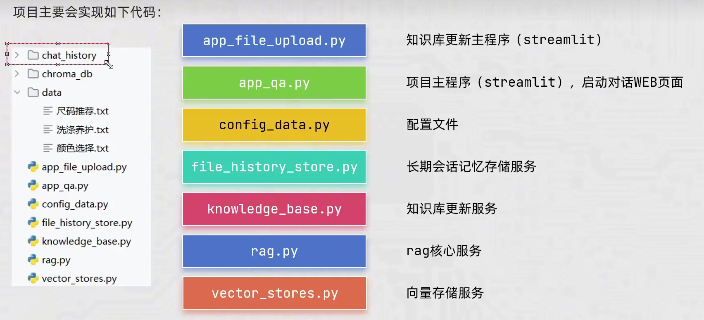

# 项目需求

# 项目思路
离线流程：本地知识文件加载和读取 --> 文本切分 --> 向量数据库
在线流程：Query向量化 --> 向量匹配 --> Prompt工程 --> 提交LLM生成答案

# 项目部署
知识库更新、项目主程序（Web页面）、配置文件、向量存储服务、rag核心服务、长期会话记忆存储服务。

# 项目搭建
## 离线流程
1 WEB端文件上传.py
先写离线流程当中的Web网页上传文件，通过streamlit框架，调用st.file_uploader方法的getvalue()方法获得文本内容，再通过st.session_state的属性字典，去调用知识库基础服务中的对象，再用st.spinner()方法和time.sleep()获得更好的用户交互界面，最后将上传的文件存到数据库当中去
2 知识库基础服务.py
主要作用是将用户上传的文件存到向量数据库当中去，并返回成功的信息
考虑的点：查询数据是否存在
         将数据存入数据库
         将数据转换为md5字符串
         创建一个对象
         对于存入的数据进行备注
         长文本就行切割，短文本不进行切割，然后存入数据库当中去
3 写数据配置文件.py
将一些参数写到一个文件当中去，chroma和splitter
## 在线流程
1 

