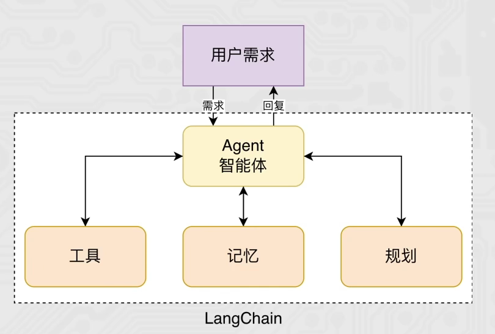

# Agent
Agent是一种能够根据用户需求自主分析、自主决策，判断调用什么工具，执行工具，拿到结果，如果效果不好，进行复盘思考，再调用工具，拿到工具，同时还有长期记忆，保存用户历史对话和需求。

## Agent的流式输出
from langchain_community.chat_models.tongyi import ChatTongyi
from langchain.agents import create_agent
from langchain_core.tools import tool

@tool(description="查询股票价格")
def get_price(name:str):
    return f"股票{name}的价格是100元"

@tool(description="获取股票信息，传入股票名称，返回字符串信息")
def get_info(name:str):
    return f"股票{name}的信息是：传智教育是一家专注于IT教育的公司，成立于2006年，总部位于北京。"

agent = create_agent(
    model=ChatTongyi(model="qwen3-max",api_key="sk-e90151cacd374f6b865b54c2fe14f1fd"),
    tools=[get_price,get_info],
    system_prompt="你是一个智能助手，可以回答股票相关问题，记住请告知我思考过程，让我知道你为什么调用某个工具"
)

res = agent.stream({
    "messages":[
        {"role":"user","content":"传智教育股价多少，并介绍一下"}
    ]
},
stream_mode = "values")

for chunk in res:
    latest_message = chunk["messages"][-1]

    if latest_message.content:
        print(f"{type(latest_message).__name__}:{latest_message.content}")
    #这里latest_message.tool_calls是简写，等价于latest_message.additional_kwargs["tool_calls"]
    
    #因为有的消息没有tool_calls，所以需要捕获AttributeError异常
    try:
        if latest_message.tool_calls:
            print(f"工具调用：{[tc['name'] for tc in latest_message.tool_calls]}")
    except AttributeError as e:
        pass

##  ReAct案例

ReAct是一种工作范式，定义了大模型的工作流程

思考：分析需求，考虑下一步 
行动：工具调用获取信息
观察：分析获取的信息

思考 ->行动 ->观察 ->再思考 ...... ->结束

##  middleware中间件

from langchain_community.chat_models.tongyi import ChatTongyi
from langchain.agents import create_agent,AgentState
from langgraph.runtime import Runtime
from langchain.tools import tool
from langchain.agents.middleware import before_agent, after_agent,before_model, after_model,wrap_model_call,wrap_tool_call

@tool(description="获取天气，传入城市名称，返回城市天气")
def get_weather(city:str):
    return f"城市{city}的天气是晴天"

"""
1：agent执行前
2：agent执行后
3：model执行前
4：model执行后
5：工具执行中
6：模型执行中

"""
agent在执行前会调用这个函数，并传入state和runtime两个对象
@before_agent
def log_before_agent(state:AgentState,runtime:Runtime):
    print(f"agent执行前，附带了{len(state['messages'])}个消息")

@after_agent
def log_after_agent(state:AgentState,runtime:Runtime):
    print(f"agent执行后，附带了{len(state['messages'])}个消息")

@before_model
def log_before_model(state:AgentState,runtime:Runtime):
    print(f"model执行前，附带了{len(state['messages'])}个消息")

@after_model
def log_after_model(state:AgentState,runtime:Runtime):
    print(f"model执行后，附带了{len(state['messages'])}个消息")

@wrap_model_call
def model_call_hook(request,handler):
    print("模型调用了")
    return handler(request)

@wrap_tool_call
def monitor_tool(request,handler):
    print(f"工具执行:{request.tool_call['name']}")
    print(f"工具执行传入的参数:{request.tool_call['args']}")
    return handler(request)

agent = create_agent(
    model=ChatTongyi(model="qwen3-max",api_key="sk-e90151cacd374f6b865b54c2fe14f1fd"),
    tools=[get_weather],
    system_prompt="你是一个智能助手，可以回答用户问题，并且可以调用工具获取天气信息 ",
    middleware=[log_before_agent,log_after_agent,log_before_model,log_after_model,monitor_tool,model_call_hook]
)

res=agent.invoke({
    "messages":[
        {"role":"user","content":"深圳的天气怎么样？如何穿衣"}
    ]
})

print("========================\n",res)