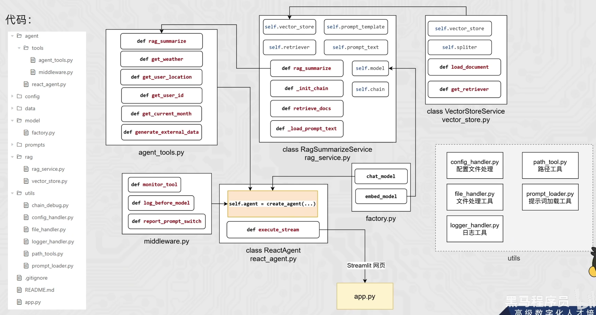

# 智能体项目

##  工具配置
path_tool.py（路径工具）
调用这个文件，目的是返回文件的绝对路径
logger_handler.py（日志工具）
写这个文件的目的是，写日志文件。程序运行产生的日志，一边在控制台打印出来，一边自动写入本地文件永久保存。
config_handler.py（配置项工具）
这个文件的目的是将硬盘四个yaml中的配置转换为字典类型方便调用。
file_handler.py（文件工具）
用来计算文件的md5、筛选指定类型的文件、加载PDF和TXT文件。
prompts_loader.py(提示词加载工具)
专门负责加载 AI 提示词（prompt）文本内容。
