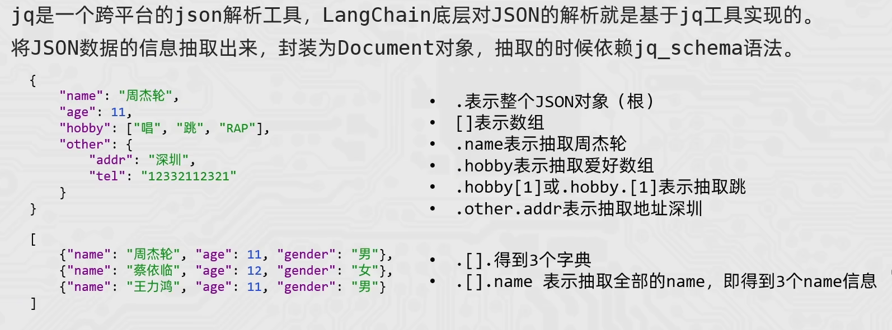

# Chain链
通过将组件串联，将上一个组件的输出作为下一个组件的输入。
chain = prompt_template | model
返回类型是RunableSequence类对象
**核心前提**：即Runnable子类对象才能入链（以及Callable、Mapping接口子类对象也可加入）
！[说明图片](Runnable继承关系.png)

## model.invoke和model.stream方法
**model.invoke**
同步阻塞调用，必须等模型全部生成完成，才一次返回完整结果。
from langchain_openai import ChatOpenAI
model = ChatOpenAI(model="gpt-3.5-turbo")

response = model.invoke("介绍一下AI")
print(response.content)  # 一次性输出完整文本
**model.stream**
流式执行调用，模型边生成边返回分片（需要for循环）
for chunk in model.stream("介绍一下AI"):
    print(chunk.content, end="", flush=True)  # 实时追加显示

还有 ainvoke() / astream() 异步版本，不阻塞主线程。

## Runnable接口

## 字符串输出解析器 StrOutputParser
**产生原因**
chain = prompt | model | model
    prompt的结果是  PromptValue类型，输入给了model
    model的输出结果是：AIMessage
    而模型的输入要求类型是：PromptValue、Str、Sequence[MessageLikeRepresentation]

## JSON输出解析器 JsonOutputParser
chain = first_prompt | model | json_parser | second_prompt | model | str_parser
将AIMessage的输出JSON格式作为输入，输出dict格式的数据

## 自定义Runnable.Lambda匿名函数实现自定义逻辑的数据转换
基于RunableLambda类实现，
func_lambda = RunnableLambda(lambda ai_msg: {"name": ai_msg.content})

chain = first_prompt | model | func_lambda | second_prompt | model | str_parser

## Chain的输入输出
**prompt**的输入为：dict
{
    "question": "写一首关于春天的诗，返回JSON格式"
}
输出：list[dict]
[
    {"role": "system", "content": "你是一个诗人"},
    {"role": "user", "content": "写一首关于春天的诗，返回JSON格式"}
]

**model**的输入为 list [dict]

输出为AIMessage消息对象类型
AIMessage(
    content='{"title":"春晓","content":"春眠不觉晓"}'
)

**json_parser**的输入为AIMessage**返回的JSON字符串**
输出为dict
{
    "title": "春晓",
    "content": "春眠不觉晓"
}

**str_parser**的输入为AIMessage
AIMessage(
    content="大漠孤烟直，长河落日圆。",
    role="assistant"
)
输出为str
"大漠孤烟直，长河落日圆。"

## 临时会话记忆
from langchain_core.runnables.history import RunnableWithMessageHistory
from langchain_core.chat_history import InMemoryChatMessageHistory

prompt = ChatPromptTemplate.from_messages(
    [
        ("system", "你需要根据会话历史回应用户问题。对话历史："),
        MessagesPlaceholder("chat_history"),
        ("human", "请回答如下问题：{input}")
    ]
)
enhanced_chain = RunnableWithMessageHistory(
    base_chain,  # 被附加历史消息的 Runnable，通常是 Chain
    get_history,  # 获取历史会话的函数
    input_messages_key="input",  # 用户当前输入在 dict 里的键
    history_messages_key="chat_history"  # 历史消息注入到 dict 里的键
)
    session_config = {
        "configurable": 
        {"session_id": "123"} }

## 长期会话记忆(基于文件存储会话记录)
FileChatMessageHistor类的实现：
基于文件存储会话记录，以session_id为文件名，不同session_id有不同文件存储消息
继承BaseChatMessageHistory实现如下3个方法：
    add_messages:同步模式，添加消息
    messages：同步模式，获取消息
    clear：同步模式，清除消息

class FileChatMessageHistory(BaseChatMessageHistory):
    def __init__(self,session_id,storage_path):
        self.session_id = session_id    #会话id
        self.storage_path = storage_path  #存储路径
        
        self.file_path = os.path.join(self.storage_path,self.session_id)  #文件路径
        
        #确保文件夹是存在的，如果不存在则创建
        os.makedirs(os.path.dirname(self.file_path),exist_ok=True)

    #Sequence序列 类似于list，tuple
    def add_messages(self, messages: Sequence[BaseMessage]) -> None:

        all_messages = list(self.messages)      #确保兼容性Sequence[BaseMessage]转换为List[BaseMessage]，已有的消息列表
        all_messages.extend(messages)           #添加新消息
        
        #将数据同步写到本地文件当中   类对象写到文件当中是二进制，可以将BaseMessage消息转为字典
        # new_messages = []
        # for message in all_messages:
        #     d = message.to_dict(message)
        #     new_messages.append(d)
        new_messages = [message_to_dict(message) for message in all_messages]
        #字典序列化成json格式
        with open(self.file_path,'w',encoding='utf-8') as f:
            json.dump(new_messages,f)
    @property          #通过property装饰器，将messages方法变成属性，可以直接通过类对象.messages访问
    def messages(self) -> list[BaseMessage]:
        #带 s = 处理字符串（loads / dumps）
        # 不带 s = 处理文件（load / dump）
        #当前文件内:是List[Json],然后load之后返回的是List[Dict],为了转换为消息对象，使用messages_from_dict
        try:
            with open(self.file_path,'r',encoding='utf-8') as f:
                messages_data = json.load(f)       
            return messages_from_dict(messages_data)
        except FileNotFoundError:
            return []
    
    def clear(self) -> None:
        with open(self.file_path, "w", encoding="utf-8") as f:
            json.dump([], f, ensure_ascii=False)

message_to_dict:将消息对象转换为字典
messages_from_dict：将List[字典]转换为消息对象

## 文档加载器（Document loaders）
将所有的数据转换为Document类对象
### CSVLoader
loader = CSVLoader(
    file_path="./data/stu.csv",
    csv_args={
        "delimiter":",",
        "quotechar":'"',
        #如果数据没有表头，这里可以指定表头，如果有则不要用
        "fieldnames":["a","b","c","d"],
    },
    encoding="utf-8",  # Windows 默认 gbk；本 CSV 为 UTF-8 中文
)

loader.load() → List[Document]（列表，全在内存）
loader.lazy_load() → Iterator[Document]（迭代器，用多少加载多少）

批量加载 .load() 返回的是列表，每个元素是一个Document类对象
data = loader.load()

 for d in data:
     print(d,type(d))

惰性加载 .lazy_load() 返回的是生成器，每次返回一个Document类对象
for document in loader.lazy_load():
    print(document)

### JsonLoader(pip)

**单个JSON对象**
loader = JSONLoader(
    file_path="./data/stu.json",
    jq_schema=".",
    text_content=False, #告知JSONLoader,我抽取的内容不是字符串，是JSON对象
)

documents = loader.load()
print(documents)

**数组中多个JSON对象**
loader = JSONLoader(
    file_path="./data/stus.json",
    jq_schema=".[].name",
    text_content=False, #告知JSONLoader,我抽取的内容不是字符串，是JSON对象
)

document = loader.load()
print(document)

**JSON行**
loader = JSONLoader(
    file_path="./data/stu_json_lines.json",
    jq_schema=".name",
    text_content=False, #告知JSONLoader,我抽取的内容不是字符串，是JSON对象
    json_lines=True, #告知JSONLoader,我抽取的内容是JSON对象，是JSON行
)

documents = loader.load()
print(documents)

### TextLoader和文档分割器
from langchain_community.document_loaders import TextLoader
from langchain_text_splitters import RecursiveCharacterTextSplitter

loader = TextLoader(
    file_path="./data/Python基础语法.txt",
    encoding="utf-8",
)

documents = loader.load()     #[Document对象]

splitter = RecursiveCharacterTextSplitter(
    chunk_size=500,    #分段的最大字符数
    chunk_overlap=50,  #分段的重叠字符数
    length_function=len, #分段的长度函数，默认是len，也可以是其他函数
    separators=["\n\n", "\n", " ", "","。","！","？"], #分段的分隔符
)

splits = splitter.split_documents(documents)    #将一个Document对象分割为多个Document对象

print(len(splits))
for split in splits:
    print("-"*100)
    print(split)
    print("-"*100)

### PyPDFLoader
from langchain_community.document_loaders import PyPDFLoader

loader = PyPDFLoader(
    file_path="./data/pdf2.pdf",
    mode="single",              #默认是page模式，每个页面生成一个Document文档对象
                                #single模式：不管有多少页面，只返回一个Document对象
    password="itheima"          #pdf文件的密码
    )

i=0
for document in loader.lazy_load():
    i+=1
    print(document,i)
    print("-"*100,i)

## 向量存储（索引阶段--存储）
涉及到的阶段：1 如何将文本转为向量
             2 创建向量存储，基于向量存储完成（存入向量，删除向量，向量检索）
### 内存存储
from langchain_community.embeddings import DashScopeEmbeddings
from langchain_core.vectorstores import InMemoryVectorStore
from langchain_community.document_loaders import CSVLoader
vector_store = InMemoryVectorStore(
    embedding=DashScopeEmbeddings(dashscope_api_key="###"),
)

loader = CSVLoader(
    file_path="./data/info.csv",
    encoding="utf-8",
    source_column="source",
)
documents = loader.load()

vector_store.add_documents(
    documents=documents,            #被添加的文本
    ids=["id"+str(i) for i in range(len(documents))],      #对于每个document分配一个id 
)

vector_store.delete(ids=["id1","id2"])      #删除id为id1和id2的document

results = vector_store.similarity_search(
    query="Python很简单",
    k=3
    )      #相似度搜索，返回k个最相似的document
### 外置文件存储
from langchain_community.embeddings import DashScopeEmbeddings
from langchain_chroma import Chroma
from langchain_community.document_loaders import CSVLoader

#Chroma 向量数据库（轻量级的）
vector_store = Chroma(
    collection_name="test",          #为当前向量存储起个名字，类似于数据库的表名称
    embedding_function=DashScopeEmbeddings(dashscope_api_key="###"),
    #指定嵌入模型
    #指定存储的目录，可以指定一个文件夹，也可以指定一个数据库
    persist_directory="./chroma_db",
)

loader = CSVLoader(
    file_path="./data/info.csv",
    encoding="utf-8",
    source_column="source",    #指定数据的来源是哪里
)
documents = loader.load()

#添加文档
vector_store.add_documents(
    documents=documents,            #被添加的文本
    ids=["id"+str(i) for i in range(len(documents))],      #对于每个document分配一个id 
)

#删除文档
vector_store.delete(ids=["id1","id2"])      #删除id为id1和id2的document

#相似度搜索
results = vector_store.similarity_search(
    query="Python很简单",
    k=3,
    filter={"source": "黑马程序员"},    #指定过滤条件,内存库不支持元数据过滤
    )      #相似度搜索，返回k个最相似的document

## 向量检索（检索阶段--回答）

from langchain_core.prompts import ChatPromptTemplate
from langchain_core.output_parsers import StrOutputParser
from langchain_community.chat_models import ChatTongyi
from langchain_core.vectorstores import InMemoryVectorStore
from langchain_community.embeddings import DashScopeEmbeddings

prompt = ChatPromptTemplate.from_messages([
    ("system","你是一个专家，简洁回答问题,参考文献是：{context}"),
    ("user","用户提问是{input},不用回复参考文献"),
])

model = ChatTongyi(model="qwen3-max")

vector_store = InMemoryVectorStore(
    embedding=DashScopeEmbeddings(dashscope_api_key),
)

vector_store.add_texts(["减肥就是要少吃多练","减脂期间吃很重要","跑步很重要"])

input_text = "怎么减肥?"

#向量检索
results = vector_store.similarity_search(input_text,k=3)
#构建参考文献
reference_text ="["+",".join([result.page_content for result in results])+"]"

def get_prompt(prompt):
    print("-"*100)
    print(prompt.to_string())
    print("-"*100)
    return prompt
#构建chain
chain = prompt | get_prompt | model | StrOutputParser()

#执行chain
response = chain.invoke({"context":reference_text,"input":input_text})
print(response)

## RunnablePassthrough的使用

as_retriever方法可以将 向量存储对象，返回一个Runnable接口的子类实例对象

**RunnablePassthrough()**用于传递上下文,将输入原封不动的传到下一阶段

**retriever**:
         -输入：用户的提问       str
         -输出：向量库的检索结果   List[Document]
**prompt**:
         -输入：用户的提问+向量库的检索结果     dict/list[dict]
         -输出：完整的提示词       PromptValue

from langchain_core.prompts import ChatPromptTemplate
from langchain_core.output_parsers import StrOutputParser
from langchain_community.chat_models import ChatTongyi
from langchain_core.vectorstores import InMemoryVectorStore
from langchain_community.embeddings import DashScopeEmbeddings
from langchain_core.runnables import RunnablePassthrough
from langchain_core.documents import Document

prompt = ChatPromptTemplate.from_messages([
    ("system","你是一个专家，简洁回答问题,参考文献是：{context}"),
    ("user","用户提问是{input},不用回复参考文献"),
])

model = ChatTongyi(model="qwen3-max",api_key="###")

vector_store = InMemoryVectorStore(
    embedding=DashScopeEmbeddings(dashscope_api_key="###"),
)
 add_texts（List[str]） 添加文本到向量存储当中
vector_store.add_texts(["减肥就是要少吃多练","减脂期间吃很重要","跑步很重要"])

input_text = "怎么减肥?"

def format_func(docs):
    if not docs:
        return "无相关参考资料"
    formatted_str = "[" + ", ".join([doc.page_content for doc in docs]) + "]"
    return formatted_str

def print_func(output):
    print("-"*100)
    print(output.to_string())
    print("-"*100)
    return output

retriever = vector_store.as_retriever(search_kwargs={"k": 2})

chain = ({"context":retriever | format_func,"input":RunnablePassthrough()}| prompt | print_func | model | StrOutputParser())
response = chain.invoke(input_text)
print(response)

