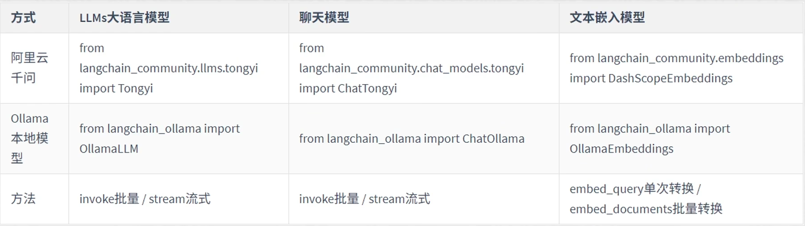
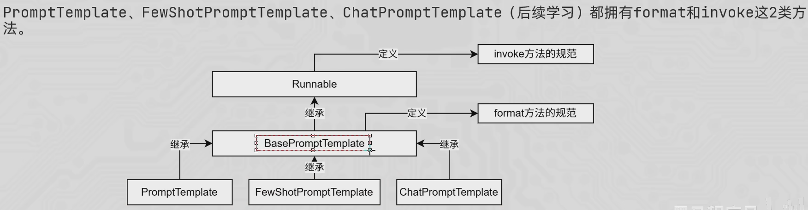
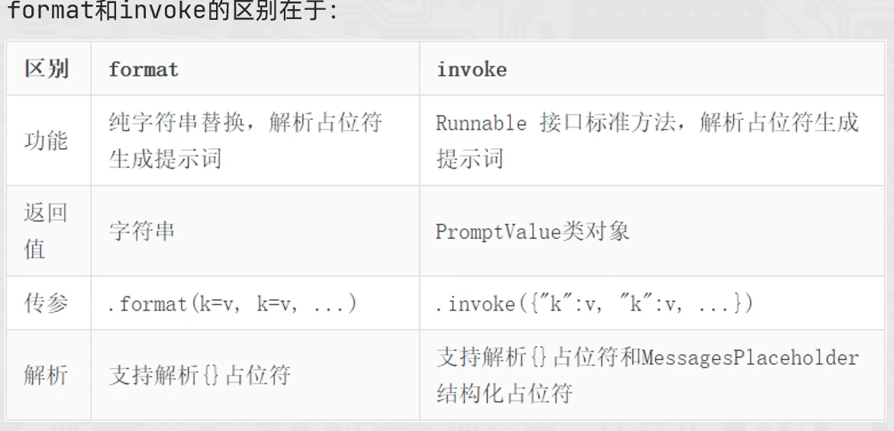

# RAG
LLM知识不是实时的，没有更新迭代的能力
LLM缺乏领域知识，无法覆盖特定领域或高度专业化的内部知识
幻觉问题——大模型一本正经的胡说
数据安全性

# RAG(准备增强生成)
在线
将用户的提问信息进行向量化，去向量库做相似度匹配，找出相关知识，将提问信息和知识信息prompt送给大模型，大模型回答。

离线：知识库预处理
将外部最新的知识进行搜集，在进行切割为小块，向量化，存入向量库

## 向量（含有语义的数字语言）
将文字的语义信息，转换为一串固定长度的数字列表，目的是将文本的含义告诉计算机

### 文本向量的计算
借助文本嵌入模型来实现：text-embedding-v1

### 文本向量匹配（余弦相似度）
A:你是谁 = [0.2,0.1]
B:谁是你 = [0.3，0.05]
通过**余弦相似度**来判断两个向量是否相似，或者说是文本是否相似

### 文本向量的维度
维度数代表模型用多少个抽象语义特征来描述文本
(维度越多，语义特征越好，语义匹配更准确。但是相应的计算可能会更多，可能会有噪声)

# LangChain

## 模型分类
LLMs:是技术范畴的统称，指基于大参数量、海量文本训练的Transformer架构模型，核心能力是理解和生成自然语言，主要服务于文本生成场景
聊天模型:是应用范畴的细分，是专为对话场景优化的LLMs，核心能力是模拟人类对话的轮次交互，主要服务于聊天场景文本嵌入模型:文本嵌入模型接收文本作为输入，得到文本的向量

## 模型输出方式：LLM模型
from langchain_community.llms.tongyi import Tongyi 用来导入tongyi的大语言模型库
model.invoke()方法:一次性返回完整结果
model.stream()方法:逐段返回结果，流式输出

## message类的书写方式：聊天模型
messages = [
    #是静态的，直接得到了Message类的类对象
    SystemMessage(content="你是一个边塞诗人"),
    HumanMessage(content="写一首关于边塞的诗"),
    AIMessage(content="大漠孤烟直，长河落日圆。"),
    HumanMessage(content="按照这个诗的格式，写一首关于边塞的诗"),
]
'''简写形式 是动态的，需要在运行时由LangChain内部机制将元组转换为Message类的类对象（简写时支持变量的占位符）
messages = [
    ("system","你是一个边塞诗人"),
    ("human","写一首关于边塞的诗"),
    ("ai","大漠孤烟直，长河落日圆。{neirong}"),
    ("human","按照这个诗的格式，写一首关于边塞的诗"),
    ]
'''

## 文本嵌入模型（两种方法）

from langchain_community.embeddings import DashScopeEmbeddings

model = DashScopeEmbeddings(
    model="text-embedding-v1",
    dashscope_api_key="###",
)

print(model.embed_query("我喜欢你"))
print(model.embed_documents(["我喜欢你","我爱你","我想你"]))

## 提示词模板
PromptTemplate：通用提示词模板，支持动态注入信息.
FewShotPromptTemplate:支持基于模板注入任意数量的示例信息。
ChatPromptTemplate:支持注入任意数量的历史会话信息。
### zero-shot
from langchain_core.prompts import PromptTemplate

构建模板
prompt_template = PromptTemplate.from_template(
    "我的邻居姓{last_name}，名{first_name}，他的年龄是{age}岁"
)

调用**format方法**，注入信息
prompt_text = prompt_template.format(last_name="张",first_name="三",age=18)

调用大模型去回答
model = Tongyi(model="qwen-turbo", api_key="###")
res = model.invoke(prompt_text)
print(res)

### Few-shot（需要示例样本）
from langchain_core.prompts import FewShotPromptTemplate,PromptTemplate

#示例的模板
example_template = PromptTemplate.from_template(
    "单词：{word}，反义词：{antonym}"
)
#示例的动态数据注入，要求是list当中内套字典
examples_data = [
    {"word":"happy","antonym":"sad"},
    {"word":"tall","antonym":"short"},
    {"word":"big","antonym":"small"},
    {"word":"fast","antonym":"slow"},
    {"word":"good","antonym":"bad"},
]

few_shot_prompt_template = FewShotPromptTemplate(
    example_prompt=example_template,   #示例模板
    examples=examples_data,            #示例数据用来注入动态数据,list当中内套字典
    prefix="告诉我单词的反义词，我提供如下的示例:",       #示例之前的提示词
    suffix="基于前面的案例，{input}的反义词是：",        #示例之后的提示词
    input_variables=["input"]     #声明在前缀或后缀中所需要注入的变量名
)

进行信息注入（**invoke方法**）
res = few_shot_prompt_template.invoke({"input":"left"}).to_string()
调用模型
model = Tongyi(model="qwen-turbo", api_key="###")
print(model.invoke(res))

## format和invoke的方法

